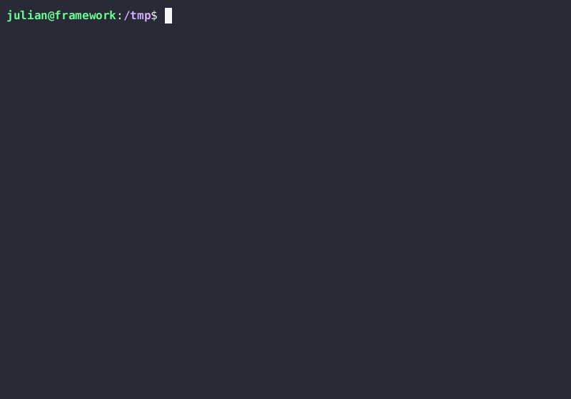

# soli - A Solidity REPL

This is a work in progress! See the list of features below [at the bottom of the
README](#features).

## Installation

Installation requires Rust. You can install the Rust toolchain with
[rustup](https://rustup.rs/).

```bash
git clone https://github.com/jpopesculian/soli.git
cd soli
cargo install --path .
```

## Usage

Type some valid Solidity and hope for the best. Type `/help` for some extra commands



## Features

- [x] Add statements
- [x] Add custom events, errors, functions, imports
- [x] Inspect a variable
- [ ] Fork an existing chain
- [ ] Allow the use of private keys and custom sender
- [ ] More advanced introspection
- [ ] Better error messages and traces
